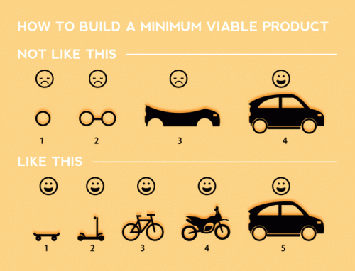

functions with R
========================================================
author: Hezi Buba & Irene Steves
date: 18/12/2018
autosize: true

Presentation materials: https://github.com/ecodatasci-tlv/functions 

Why write functions?
========================================================
Sometimes, we tend to repeat ourselves when coding: Repeating similar analyses, getting data ready for plots, etc.
Functions have multiple advantages over copy and pasting chuncks of code:
- Naming a function improve readability of code ("write codes for humans")
- Changing paramters and conditions in one place.
- Eliminate chance of mistakes due to copy-pasting.

When to write functions?
=======================================================
A good rule of thumb is to not copy and paste code more than twice.


```r
df$a <- (df$a - min(df$a, na.rm = TRUE)) / 
  (max(df$a, na.rm = TRUE) - min(df$a, na.rm = TRUE))
df$b <- (df$b - min(df$b, na.rm = TRUE)) / 
  (max(df$b, na.rm = TRUE) - min(df$a, na.rm = TRUE))
df$c <- (df$c - min(df$c, na.rm = TRUE)) / 
  (max(df$c, na.rm = TRUE) - min(df$c, na.rm = TRUE))
df$d <- (df$d - min(df$d, na.rm = TRUE)) / 
  (max(df$d, na.rm = TRUE) - min(df$d, na.rm = TRUE))
```


Writing functions
========================================================



>"It is faster to make a four-inch mirror then a six-inch mirror than to make a six-inch mirror." 

****

1. Start with a limited but working chuck of code.
2. Rewrite it as a function. (psst.. FUN snippet..)

```r
name <- function(variables) {
  
}
```

3. Test it. OPTIONAL: conditional stopping of functions.
4. Name it. 
5. Use it in your code or within a more complicated function. 

How much code do we want to encapsule in a funcion?
========================================================
Suprisingly, not so much. Focus on your function doing just one thing.

Most of R's functions are less than 12 lines long!


Naming functions
========================================================
Function names should be kept short yet informative. Remember: functions are meant to help codes be reusable and readable.

What are good names for these two functions?


```r
f1 <- function(string, prefix) {
  substr(string, 1, nchar(prefix)) == prefix
}
f2 <- function(x) {
  if (length(x) <= 1) return(NULL)
  x[-length(x)]
}
```

Iterations
========================================================


99 bottles of beer on the wall
========================================================

>99 bottles of beer on the wall, 99 bottles of beer. Take one down, pass it around - 98 bottles of beer on the wall
